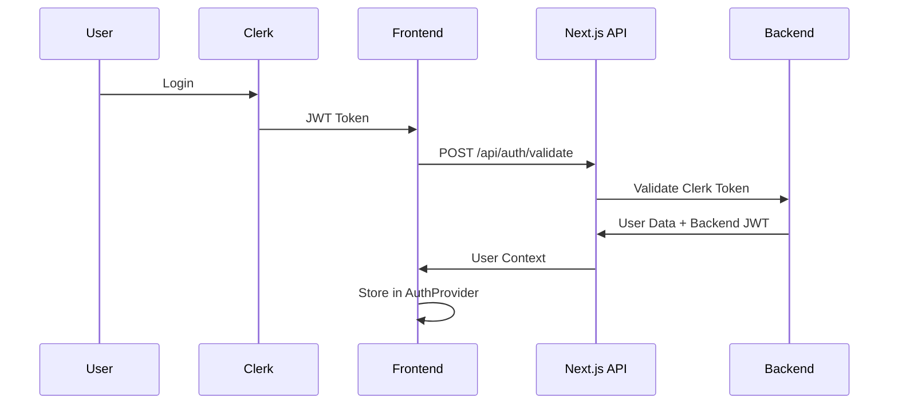
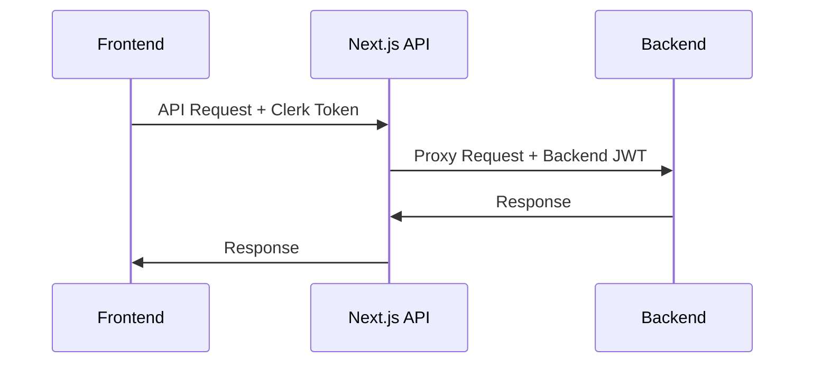

# Система авторизации

## Обзор

Проект использует двухуровневую систему авторизации:

1. **Clerk.com** - внешняя аутентификация и управление пользователями
2. **Внутренняя система** - валидация токенов и управление ролями

## Архитектура авторизации

```
┌─────────────┐    ┌─────────────┐    ┌─────────────┐
│   Frontend  │    │  Next.js    │    │   .NET      │
│             │    │   API       │    │  Backend    │
│ Clerk Auth  │◄──►│ Proxy +     │◄──►│ Validation  │
│             │    │ Validation  │    │ + Roles     │
└─────────────┘    └─────────────┘    └─────────────┘
```

## Компоненты системы

### 1. Clerk.com Integration

#### Конфигурация

```typescript
// app/layout.tsx
<ClerkProvider>
  <AuthProvider>
    <OrganizationProvider>{children}</OrganizationProvider>
  </AuthProvider>
</ClerkProvider>
```

#### Middleware защита

```typescript
// middleware.ts
const isProtectedRoute = createRouteMatcher(["/ads(.*)", "/search", "/my-ads"]);

export default clerkMiddleware(async (auth, req) => {
  if (isProtectedRoute(req)) await auth.protect();
});
```

### 2. AuthProvider

Основной провайдер авторизации (`context/auth-context.tsx`):

```typescript
interface AuthContextType {
  backendToken: string | null;
  errorStatus: UserStatus | null;
  userId: string | null;
  userRole: UserRole | null;
  logout: () => Promise<void>;
  setErrorStatus: React.Dispatch<React.SetStateAction<UserStatus | null>>;
}
```

#### Функциональность:

- Валидация Clerk токенов
- Получение JWT токенов от бекенда
- Управление состоянием пользователя
- Обработка ошибок авторизации

### 3. Backend Token Management

#### Хук useBackendToken

```typescript
// context/use-backend-token.ts
interface BackendTokenContext {
  token: string | null;
  userId: string | null;
  role: UserRole | null;
  setUser: (user: User) => void;
  removeUser: () => void;
}
```

## Поток авторизации

### 1. Первичная авторизация



### 2. Защищенные запросы



## Типы пользователей

### UserRole

```typescript
enum UserRole {
  Admin = "admin",
  User = "user",
}
```

### UserStatus

```typescript
enum UserStatus {
  Active = "active",
  Unconfirmed = "unconfirmed",
  AccessDenied = "access_denied",
  Deleted = "deleted",
}
```

## Защищенные маршруты

### Middleware конфигурация

```typescript
// middleware.ts
const isProtectedRoute = createRouteMatcher([
  "/ads(.*)", // Все страницы объявлений
  "/search", // Страница поисков
  "/my-ads", // Страница моих объявлений
]);
```

### Публичные маршруты

- `/` - главная страница
- `/about_us` - о нас
- `/privacy_policy` - политика конфиденциальности
- `/terms_of_use` - условия использования

## Обработка ошибок

### Типы ошибок авторизации

1. **Не авторизован** - пользователь не вошел в систему
2. **Доступ запрещен** - недостаточно прав
3. **Аккаунт не подтвержден** - требуется подтверждение
4. **Аккаунт удален** - аккаунт заблокирован

### AuthErrorModal

```typescript
// components/auth-error-modal/auth-error-modal.tsx
interface AuthErrorModalProps {
  errorStatus: UserStatus;
  onClose: () => void;
}
```

## Организации

### OrganizationProvider

```typescript
// context/organization-context.tsx
interface OrgCtx {
  myOrganizations: Organization[] | null;
  activeOrganizationId: string | null;
  setActiveOrganization: (id: string) => void;
  isLoading: boolean;
}
```

### Заголовки организации

Все API запросы включают заголовок:

```
X-Organization-Id: <organization_id>
```

## Безопасность

### 1. Токены

- **Clerk JWT** - для аутентификации
- **Backend JWT** - для авторизации на бекенде
- Автоматическое обновление токенов

### 2. Валидация

- Проверка токенов на каждом запросе
- Валидация ролей и статуса пользователя
- Автоматический logout при ошибках

### 3. Защита маршрутов

- Middleware проверка на уровне Next.js
- Дополнительная проверка в компонентах
- Graceful handling ошибок

## Использование в компонентах

### Получение контекста авторизации

```typescript
import { useBackendAuthContext } from "@/context/auth-context";

function MyComponent() {
  const { backendToken, userId, userRole, logout } = useBackendAuthContext();

  // Использование данных пользователя
}
```

### Получение контекста организации

```typescript
import { useOrganization } from "@/context/organization-context";

function MyComponent() {
  const { activeOrganizationId, setActiveOrganization } = useOrganization();

  // Работа с организациями
}
```

### Авторизованные запросы

```typescript
import { useFetchWithAuth } from "@/hooks/use-fetch-with-auth";

function MyComponent() {
  const { fetchWithAuth } = useFetchWithAuth();

  const fetchData = async () => {
    const response = await fetchWithAuth("/api/ads");
    // Обработка ответа
  };
}
```

## Конфигурация

### Переменные окружения

```env
NEXT_PUBLIC_CLERK_PUBLISHABLE_KEY=pk_test_...
CLERK_SECRET_KEY=sk_test_...
NEXT_PUBLIC_CLERK_SIGN_IN_URL=/sign-in
NEXT_PUBLIC_CLERK_SIGN_UP_URL=/sign-up
NEXT_PUBLIC_CLERK_AFTER_SIGN_IN_URL=/ads
NEXT_PUBLIC_CLERK_AFTER_SIGN_UP_URL=/ads
```

### Clerk настройки

- **Sign-in URL:** `/sign-in`
- **Sign-up URL:** `/sign-up`
- **After sign-in:** `/ads`
- **After sign-up:** `/ads`

## Отладка

### Логирование

```typescript
// Включить в development режиме
console.log("Auth state:", { userId, userRole, backendToken });
```

### Проверка состояния

```typescript
// Проверка авторизации
const { isSignedIn } = useAuth();

// Проверка бекенд токена
const { backendToken } = useBackendAuthContext();
```

## Troubleshooting

### Частые проблемы

1. **Токен не обновляется**

   - Проверить конфигурацию Clerk
   - Убедиться в правильности template токена

2. **Ошибка 401 на запросах**

   - Проверить наличие backendToken
   - Убедиться в валидности токена

3. **Организация не загружается**
   - Проверить заголовок X-Organization-Id
   - Убедиться в правильности ID организации

### Решение проблем

1. Очистить localStorage/sessionStorage
2. Перезапустить приложение
3. Проверить консоль браузера на ошибки
4. Убедиться в правильности переменных окружения
