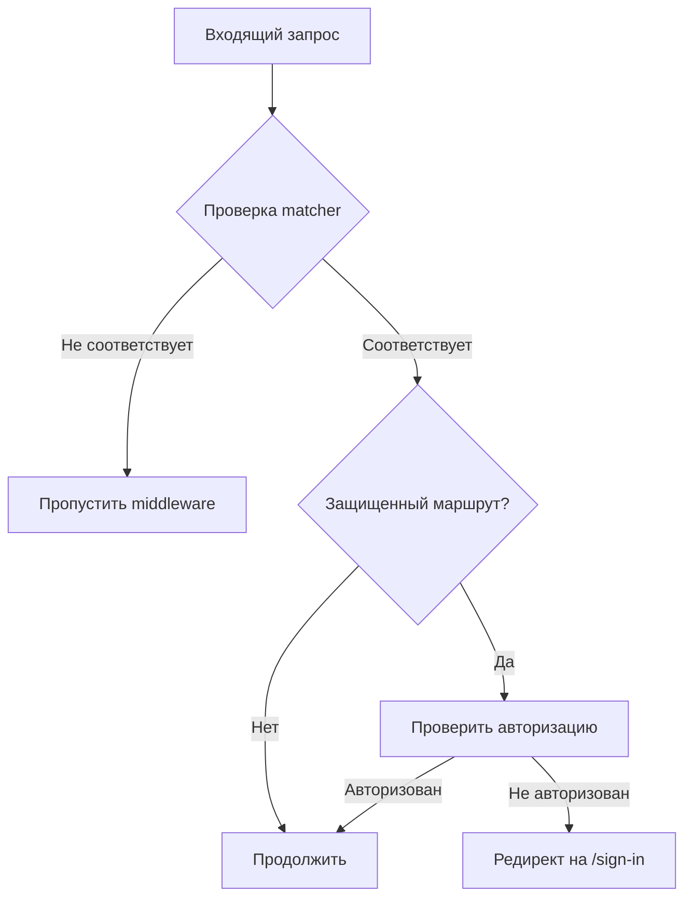

# Middleware Документация

## Обзор

Middleware в Next.js обеспечивает защиту маршрутов и обработку запросов на уровне сервера. В проекте используется Clerk middleware для аутентификации и авторизации.

## Основной middleware

### Файл: `middleware.ts`

```typescript
import { clerkMiddleware, createRouteMatcher } from "@clerk/nextjs/server";

const isProtectedRoute = createRouteMatcher(["/ads(.*)", "/search", "/my-ads"]);

export default clerkMiddleware(async (auth, req) => {
  if (isProtectedRoute(req)) await auth.protect();
});

export const config = {
  matcher: [
    "/((?!_next|[^?]*\\.(?:html?|css|js(?!on)|jpe?g|webp|png|gif|svg|ttf|woff2?|ico|csv|docx?|xlsx?|zip|webmanifest)).*)",
    "/(api|trpc)(.*)",
  ],
};
```

## Функциональность

### 1. Защита маршрутов

#### Защищенные маршруты

- `/ads/*` - все страницы объявлений
- `/search` - страница поисков
- `/my-ads` - страница моих объявлений

#### Публичные маршруты

- `/` - главная страница
- `/about_us` - о нас
- `/privacy_policy` - политика конфиденциальности
- `/terms_of_use` - условия использования
- `/sign-in` - страница входа
- `/sign-up` - страница регистрации

### 2. Обработка запросов

#### API Routes

Все API маршруты (`/api/*`) проходят через middleware для:

- Проверки авторизации
- Добавления заголовков
- Проксирования к бекенду

#### Статические ресурсы

Исключены из обработки middleware:

- `_next/*` - Next.js внутренние файлы
- Изображения (jpg, png, gif, svg, webp)
- Шрифты (ttf, woff, woff2)
- Документы (pdf, docx, xlsx)
- Архивы (zip)
- CSS и JS файлы

## Конфигурация

### Matcher Pattern

```typescript
export const config = {
  matcher: [
    // Исключить статические файлы и Next.js внутренние файлы
    "/((?!_next|[^?]*\\.(?:html?|css|js(?!on)|jpe?g|webp|png|gif|svg|ttf|woff2?|ico|csv|docx?|xlsx?|zip|webmanifest)).*)",
    // Включить все API маршруты
    "/(api|trpc)(.*)",
  ],
};
```

### Route Matcher

```typescript
const isProtectedRoute = createRouteMatcher([
  "/ads(.*)", // Все подстраницы объявлений
  "/search", // Точное совпадение для поиска
  "/my-ads", // Точное совпадение для моих объявлений
]);
```

## Поток выполнения

### 1. Входящий запрос



### 2. Обработка авторизации

```typescript
export default clerkMiddleware(async (auth, req) => {
  // Проверка защищенного маршрута
  if (isProtectedRoute(req)) {
    // Принудительная проверка авторизации
    await auth.protect();
  }

  // Дополнительная логика может быть добавлена здесь
});
```

## Интеграция с Clerk

### ClerkMiddleware

Clerk middleware предоставляет:

- Автоматическую проверку JWT токенов
- Управление сессиями
- Редиректы для неавторизованных пользователей
- Интеграцию с Clerk компонентами

### Функции auth

```typescript
// Доступные методы в auth объекте
await auth.protect(); // Принудительная проверка
await auth.redirectToSignIn(); // Редирект на вход
await auth.redirectToSignUp(); // Редирект на регистрацию
```

## Расширение middleware

### Добавление новых защищенных маршрутов

```typescript
const isProtectedRoute = createRouteMatcher([
  "/ads(.*)",
  "/search",
  "/my-ads",
  "/admin(.*)", // Новый защищенный маршрут
  "/settings", // Еще один защищенный маршрут
]);
```

### Кастомная логика

```typescript
export default clerkMiddleware(async (auth, req) => {
  if (isProtectedRoute(req)) {
    await auth.protect();

    // Дополнительная проверка ролей
    const { userId } = await auth();
    if (req.nextUrl.pathname.startsWith("/admin")) {
      // Проверка админских прав
      const user = await getUser(userId);
      if (user.role !== "admin") {
        return NextResponse.redirect(new URL("/unauthorized", req.url));
      }
    }
  }
});
```

### Логирование

```typescript
export default clerkMiddleware(async (auth, req) => {
  console.log(`[Middleware] ${req.method} ${req.nextUrl.pathname}`);

  if (isProtectedRoute(req)) {
    const { userId } = await auth();
    console.log(`[Middleware] Protected route accessed by user: ${userId}`);
    await auth.protect();
  }
});
```

## Отладка

### Включение логов

```typescript
// В development режиме
if (process.env.NODE_ENV === "development") {
  console.log("Middleware executing for:", req.nextUrl.pathname);
}
```

### Проверка matcher

```typescript
// Тестирование matcher pattern
const testUrl = "/ads/some-page";
const matches = isProtectedRoute({ nextUrl: { pathname: testUrl } });
console.log(`${testUrl} is protected:`, matches);
```

## Производительность

### Оптимизация matcher

1. **Используйте точные совпадения** где возможно
2. **Группируйте похожие маршруты** с wildcard
3. **Исключайте статические ресурсы** из matcher

### Кэширование

Middleware выполняется на edge runtime, что обеспечивает:

- Быструю обработку запросов
- Минимальную задержку
- Масштабируемость

## Безопасность

### Защита от обхода

1. **Проверка на уровне middleware** - первая линия защиты
2. **Дополнительная проверка в компонентах** - вторая линия
3. **Валидация на бекенде** - финальная проверка

### Заголовки безопасности

Middleware может добавлять заголовки:

```typescript
export default clerkMiddleware(async (auth, req) => {
  const response = NextResponse.next();

  // Добавление заголовков безопасности
  response.headers.set("X-Frame-Options", "DENY");
  response.headers.set("X-Content-Type-Options", "nosniff");

  return response;
});
```

## Troubleshooting

### Частые проблемы

1. **Middleware не срабатывает**

   - Проверить matcher pattern
   - Убедиться в правильности путей

2. **Бесконечные редиректы**

   - Проверить конфигурацию Clerk
   - Убедиться в правильности sign-in URL

3. **Статические файлы блокируются**
   - Проверить исключения в matcher
   - Убедиться в правильности regex

### Решение проблем

1. **Временное отключение middleware**

   ```typescript
   // Закомментировать для отладки
   // if (isProtectedRoute(req)) await auth.protect();
   ```

2. **Добавление логов**

   ```typescript
   console.log("Request path:", req.nextUrl.pathname);
   console.log("Is protected:", isProtectedRoute(req));
   ```

3. **Проверка конфигурации Clerk**
   - Убедиться в правильности переменных окружения
   - Проверить настройки в Clerk Dashboard
